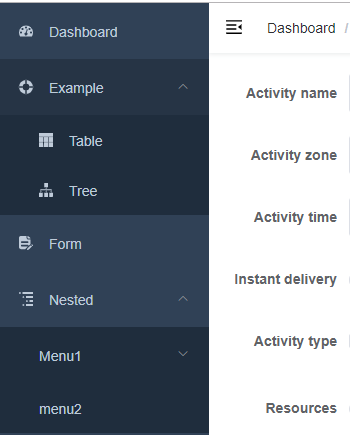

在面向B端用户的项目中，这类项目都有一个共同的特点：偏中后台管理平台，这种管理平台为了满足客户的需求，集成了各种各样的功能模块，为了使这些功能模块便于操作，导航栏是项目中必不可少的内容，这里我就简单介绍下我是如何利用iview配置导航栏的 
#### 顶部导航栏
 
#### 左侧导航栏
 
#### 框架搭建前需要准备的
- 安装node.js 安装完毕cmd输入`node -v`和`npm -v`出现版本号证明安装成功
- 安装cnpm npm install -g cnpm --registry=https://registry.npm.taobao.org
- 安装vue-cli脚手架  cnpm install vue-cli -g 安装完毕，输入vue -V 出现版本号证明安装成功

