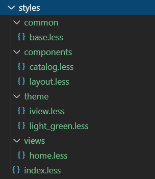

在项目开发中，对于样式文件的合理安排，一直没有清晰的思路，完全按照个人喜好来组织项目，这在后期将难以维护，所以为了照顾到其他同事的维护体验，有必要对这一块儿做深入的整理并加以规范，继而形成标准化，让它成为不仅是vue项目开发的标准，也是我在开发其它项目时参照的标准。

在`src`文件夹下新建`styles`文件夹，并在此文件夹下新建`index.less`文件,并且在`main.js`里面引用
```js
import '@/styles/index.less' // global css
```
另外也可以在`App.vue`里面引用
```js
<style lang="less">
  @import "styles/index.less";
</style>
```
题外话<sup>Tip</sup>：如果项目引用了`iview`或者`elementUI`，在`main.js`里面，需要引入：
```js
import iView from 'iview';
import 'iview/dist/styles/iview.css';
Vue.use(iView);
```
如果不想在`mian.js`里面写入样式，可以在`styles`文件夹里，任何一个less问价写入如下代码，这里我们放在`theme`的`index.less`文件里：
```js
@import '~iview/src/styles/index.less';
```
如果控制台没有报错，最好，如果提示如下内容：
>*!!vue-style-loader!css-loader?{“sourceMap”:true}!../../../../vue-loader/lib/style-compiler/index?{“vue”:true,”id”:”data-v-570115ee”,”scoped”:false,”hasInlineConfig”:false}!../../../../vux-loader/src/after-less-loader.js!less-loader?{“sourceMap”:true}!../../../../vux-loader/src/style-loader.js!../../../../vue-loader/lib/selector?type=styles&index=0!./index.vue in ./node_modules/vux/src/components/alert/index.vue

一般是缺少相关依赖导致的，提示里有`vue-style-loader!css-loader`，说明是css解析除了问题，这个时候就要看你import的什么样式文件<br>
如果是css,需要执行如下操作：
```
npm/cnpm install stylus-loader css-loader style-loader --save-dev
```
如果是less,需要执行如下操作：
```
npm/cnpm install less less-loader --save-dev
```
如果是sass,需要执行如下操作：
```
npm/cnpm sass sass-loader --save-dev
```
上述操作完毕，重启项目如果还是报错，很有可能是因为项目中所用的webpack版本差异造成的，这里我们可以将：
```js
import '@/styles/index.less' // global css
// 改成如下写法：
require('!style-loader!css-loader!less-loader!./styles/index.less');
```
这样大概率是不会报错了，接下来我们来仔细讲解项目中如何安排样式文件，我项目的styles目录结构如下：<br>
<br>
具体每个less文件里的内容，可以参考的项目：[vue-base-framework](https://github.com/darenone/vue-base-framework "vue-base-framework")样式文件链接：
[styles](https://github.com/darenone/vue-base-framework/tree/master/src/styles "styles")<br>
>备注：如果less项目编译后报错.bezierEasingMixin()，这种情况是因为less版本过高导致的，建议将less版本降低到3.0以下，比如安装2.7.3版本
```json
  "dependencies": {
    "axios": "^0.19.0",
    "echarts": "^4.2.1",
    "element-ui": "^2.10.1",
    "file-saver": "^2.0.2",
    "iview": "^3.4.2",
    "jquery": "^3.4.1",
    "less": "^2.7.3",
    "less-loader": "^5.0.0",
    "mockjs": "^1.0.1-beta3",
    "moment": "^2.24.0",
    "qs": "^6.8.0",
    "script-loader": "^0.7.2",
    "underscore": "^1.9.1",
    "vue": "^2.5.2",
    "vue-full-calendar": "^2.7.0",
    "vue-router": "^3.0.1",
    "vuex": "^3.1.1",
    "xlsx": "^0.15.1"
  },
```
<span style="color:#42c4c6;">遇到的问题</span><sup>Tip</sup>：我把所有的样式文件在index.less里面引入，然后再在main.js里面引入，但是报less变量找不到，我们可以这样解决，某个less文件夹引入了哪个less文件里的变量，就在这个less文件里重新引入这个less文件
```less
@import '../theme/index.less';
// 外框样式
.wrapper-style {
    width: 1200px;
    // border: 1px solid @wrap-border-color;
    border-color: @wrap-border-color;
}

// 清除浮动
.clearfix:after {
    content: '';
    display: block;
    height: 0;
    clear: both;
    visibility: hidden;
}
.clearfix {
    *zoom: 1;
}
```