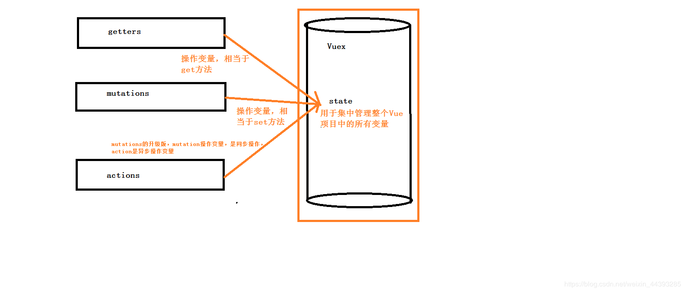
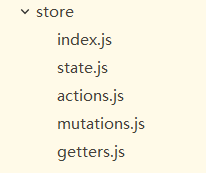

## vuex在项目中的使用详解
vuex是vue的同一状态管理模式,类似于React的redux，可以将它想象成为一个“前端数据库”，这些数据可以在项目所有的组件中获取，修改，并且在某一页面，对数据的修改可以得到全局的响应。

vuex分为五个部分：
1. state 单一状态树
2. getters 状态获取
3. mutations 触发同步事件
4. actions 提交mutation，可以包含异步操作
5. module 将vuex进行分模块

更形象的解释，可以如下图所示：

下面我们就来按照图解的思路，具体举几个例子，来理解vuex:

首先安装vuex
```
npm/cnpm install vuex --save
```
在项目`src`目录新建`store`文件夹，并在此文件夹下新建`index.js`文件，在此文件中写入如下代码：
```js
import Vue from 'vue';
import Vuex from 'vuex';
Vue.use(Vuex);
const store = new Vuex.Store();
 
export default store;
```
然后在`main.js`里面引入store：
```js
// The Vue build version to load with the `import` command
// (runtime-only or standalone) has been set in webpack.base.conf with an alias.
import Vue from 'vue'
import App from './App'
import router from './router'
import store from './store'
/*----------------引入elementUI start-----------------*/
import elementUI from 'element-ui';
import 'element-ui/lib/theme-chalk/index.css';
Vue.use(elementUI);
/*----------------end----------------*/
/*----------------引入自己的通用css-----------------*/
import '../static/css/common.css'
/*----------------end----------------*/
Vue.config.productionTip = false

/* eslint-disable no-new */
new Vue({
    el: '#app',
    router,
    store,
    components: { App },
    template: '<App/>'
})
```
然后回到`store/index.js`文件，写入如下代码：
```js
import Vue from 'vue';
import Vuex from 'vuex';
Vue.use(Vuex);
const state = {
    name: '张三',
    sex: 0,
    score: 100
}
const getters = {
    getName(state) {
        return state.name;
    },
    getSex(state) {
        switch (state.sex) {
            case 0:
                return '女';
            case 1:
                return '男';
        }
    },
    getScore(state) {
        return state.score;
    }
}
const mutations = {
    setName(state, name) {
        state.name = name;
    },
    setSex(state, sex) {
        state.sex = sex;
    },
    setScore(state, score) {
        state.score = score;
    }
}
const actions = {
    changeName(context, name) {
        context.commit('setName', name);
    },
    changeSex(context, sex) {
        context.commit('setSex', sex);
    },
    changeScore(context, score) {
        context.commit('setScore', score);
    }
}
const store = new Vuex.Store({
    state,
    getters,
    mutations,
    actions
});
export default store;
```
`变量state`： 需要共享的变量<br>
`变量getters`：类似于vue的computed属性<br>
`变量mutations`：同步改变state里面的值<br>
`变量actins`：异步改变state里面的值<br>
在组件里面调用方式如下：
```js
// 调用state
this.$store.state.score;
// 调用getters
computed: {
    score() {
        return this.$store.getters.getScore;
    }
},
// 调用mutations
this.$store.commit('setScore', 50);
// 调用actions
this.$store.dispatch('changeScore', 50);
```
在组件里面利用vuex辅助函数（`mapState`，`mapGetters`，`mapMutations`，`mapActions `）调用方式如下：
```js
<template>
    <section style="padding: 10px;">
        <el-row :gutter="20">
            <el-col :span="6">
                组件1
            </el-col>
            <el-col :span="6">
                <el-button type="primary" @click="setScore(50)">commit</el-button>
                <el-button type="primary" @click="changeScore(1000)">action</el-button>
            </el-col>
            <el-col :span="6">
                结果：{{getScore}}{{score}}
            </el-col>
        </el-row>
    </section>
</template>
<script>
import {mapState, mapGetters, mapMutations, mapActions} from 'vuex';
export default {
    data() {
        return {
        }
    },
    computed: {
        ...mapState(['score']), // ...是拓展运算符（超引用），state里有多少属性值这里就可以放多少
        ...mapGetters(['getScore'])
    },
    methods: {
        ...mapMutations(['setName', 'setSex', 'setScore']),
        ...mapActions(['changeName', 'changeSex', 'changeScore']),
    }
}
</script>
```
在组件里使用vuex辅助函数不简写方式：
```js
<script>
import {mapState, mapGetters, mapMutations, mapActions} from 'vuex';
export default {
    data() {
        return {
        }
    },
    computed: {
        ...mapState({
            score: state => state.score,
            sex: state => state.score
        }),
        ...mapGetters({
            getScore: 'getScore',
            getSex: 'getSex'
        })
    },
    methods: {
        ...mapMutations({
            setName: 'setName',
            setSex: 'setSex',
            setScore: 'setScore'
        }),
        ...mapActions({
            changeName: 'changeName',
            changeSex: 'changeSex',
            changeScore: 'changeScore'
        }),
    }
}
</script>
```
小项目可以只需要一个`index.js`文件夹就可以，但是如果项目比较负载可以采用下面的目录
<br>
`state.js`
```js
export default {
    name: '张三',
    sex: 0,
    score: 100
}
```
`getters.js`
```js
export default {
    getName(state) {
        return state.name;
    },
    getSex(state) {
        switch (state.sex) {
            case 0:
                return '女';
            case 1:
                return '男';
        }
    },
    getScore(state) {
        return state.score;
    }
}
```
`mutations.js`
```js
export default {
    SET_SHOW(state, bool) {
        state.show = bool;
    },
    setName(state, name) {
        state.name = name;
    },
    setSex(state, sex) {
        state.sex = sex;
    },
    setScore(state, score) {
        state.score = score;
    }
}
```
`actions.js`
```js
export default {
    changeShow(context, bool) {
        context.commit('SET_SHOW', bool);
    },
    changeName(context, name) {
        context.commit('setName', name);
    },
    changeSex(context, sex) {
        context.commit('setSex', sex);
    },
    changeScore(context, score) {
        context.commit('setScore', score);
    }
}
```
`index.js`
```js
import Vue from 'vue';
import Vuex from 'vuex';
import state from './state';
import mutations from './mutations';
import getters from './getters';
import actions from './actions';
Vue.use(Vuex);

const store = new Vuex.Store({
    state,
    mutations,
    getters,
    actions
});

export default store;
```
接下来介绍如何分模块处理数据，新建`modules`文件夹，如图：
<br>
`user1.js`
```js
const state = {
    name: '张三',
    sex: 0,
    score: 100
}
const getters = {
    getName(state) {
        return state.name;
    },
    getSex(state) {
        switch (state.sex) {
            case 0:
                return '女';
            case 1:
                return '男';
        }
    },
    getScore(state) {
        return state.score;
    }
}
const mutations = {
    SET_NAME(state, name) {
        state.name = name;
    },
    SET_SEX(state, sex) {
        state.sex = sex;
    },
    SET_SCORE(state, score) {
        state.score = score;
    }
}
const actions = {
    changeName(context, name) {
        context.commit('SET_NAME', name);
    },
    changeSex(context, sex) {
        context.commit('SET_SEX', sex);
    },
    changeScore(context, score) {
        context.commit('SET_SCORE', score);
    }
}
export default {
    namespaced: true, // 用于全局引用此文件里的方法时，标识这一个文件名
    state,
    getters,
    mutations,
    actions
}
```
`user2.js`同上<br>
`index.js`文件修改如下：
```js
import Vue from 'vue';
import Vuex from 'vuex';
import state from './state';
import mutations from './mutations';
import getters from './getters';
import actions from './actions';
import user1 from './modules/user1';
import user2 from './modules/user2';
Vue.use(Vuex);

const store = new Vuex.Store({
    state,
    mutations,
    getters,
    actions,
    modules: {
        user1,
        user2
    }
});

export default store;
```
调用模块里的方法如下：
```js
<template>
    <section style="padding: 10px;">
        <el-row :gutter="20">
            <el-col :span="6">
                组件1
            </el-col>
            <el-col :span="6">
                <el-button type="primary" @click="setScore(50)">commit</el-button>
                <el-button type="primary" @click="changeScore(1000)">action</el-button>
            </el-col>
            <el-col :span="6">
                结果：{{getScore}}{{score}}
            </el-col>
        </el-row>
    </section>
</template>
<script>
import {mapState, mapGetters, mapMutations, mapActions} from 'vuex';
export default {
    data() {
        return {
        }
    },
    computed: {
        ...mapState('user1', {
            score: state => state.score,
            sex: state => state.score
        }),
        ...mapGetters('user1', {
            getScore: 'getScore',
            getSex: 'getSex'
        })
    },
    methods: {
        ...mapMutations('user1', {
            setName: 'SET_NAME',
            setSex: 'SET_SEX',
            setScore: 'SET_SCORE'
        }),
        ...mapActions('user1', {
            changeName: 'changeName',
            changeSex: 'changeSex',
            changeScore: 'changeScore'
        }),
    }
}
</script>
```
最后讲一下action的异步操作：
