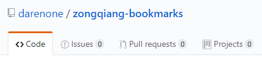
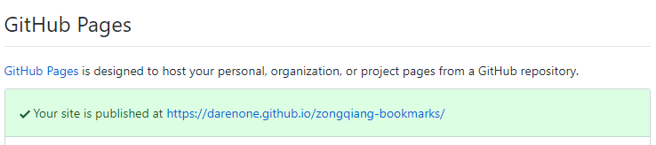
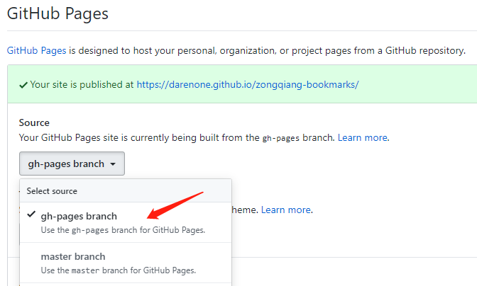

vuePress是静态网页生成器，它可以将markdown文件转化成HTML页面，而且生成的静态网页就是vue项目打包后的静态网页，可以直接部署到服务器上进行访问，它是由vue，vueRouter，webpack驱动的单页应用，
这里记录一下我是如何从0到1搭建个人博客，并打包发布到GitHub上面
### 前期准备

在合适位置新建`vuePress`项目文件夹,我电脑上的位置是：`E:\project\vue\vuePress`，cmd命令进入`vuePress`文件夹，运行如下命令：
```js
// 全局安装vuepress
npm install -g vuepress
// 初始化项目
npm init -y
// 在vuePress项目里新建docs文件夹，它将是项目的根目录，来放置markdown文件夹和.vuepress文件夹，这也是vuepress去解析的文件夹
vuePress> mkdir docs
```
除了生成的docs文件夹，还需要找到package.json，在里面做相应的配置
```json
{
  "name": "vuePress",
  "version": "1.0.0",
  "description": "",
  "main": "index.js",
  "scripts": {
    "docs:dev": "vuepress dev docs", // 运行本地命令，启动localhost即可访问网站
    "docs:build": "vuepress build docs" // 运行发布命令，生成静态文件，并将生成的静态文件放到docs/.vuepress/dist目录中
  },
  "keywords": [],
  "author": "",
  "license": "ISC"
}
```
备注<sup>Tip</sup>：关于生成的静态文件存放目录，可以通过docs/.vuepress/config.js中的dest字段来修改默认存放目录，但是一般不做修改，不然我们后面打包发布到GitHub Pages时会有麻烦，这里我们不动就行了

```js
vuePress> cd docs
vuePress\docs> mkdir .vuepress // 在docs目录下创建.vuepress目录，主要用来存放一些静态资源，主题配置，自定义组件等
vuePress\docs> cd .vuepress
vuePress\docs\.vuepress> cd > config.js // 在.vuepress目录里创建config.js文件，它是vuepress的配置文件，它导出一个JavaScript对象
vuePress\docs\.vuepress> mkdir public // 在 .vuepress目录下创建public目录，它主要用来存放静态资源文件，例如favicon和pwa的图标
vuePress\docs> cd > README.md // 在docs目录下，新建README.md 可理解为首页页面
vuePress\docs\.vuepress> mkdir dist // 在 .vuepress目录下创建dist目录,编译好的静态文件放在这里
```
### 项目配置

找到`vuePress\docs\.vuepress\config.js`的`config.js`文件,配置如下：
```javascript
module.exports = {
    title: '宗强的博客', // 博客名字
    description: '宗强的博客', // meta中的描述文字，seo用
    // 注入到当前页面的HTML <head>中的标签
    head: [
        // 增加一个favicon图表
        // '/'指向docs/.vuepress/public目录,即docs/.vuepress/public/img/geass-bg.ico
        ['link', {rel: 'icon', href: '/img/zongqiang.ico'}],
    ],
    base: '/zongqiang-bookmarks/', // 部署到GitHub相关配置
    markdown: {
        lineNumbers: true // 代码块显示行号
    },
    themeConfig: {
        sidebarDepth: 4, // 将同时提取markdown中h2 和 h3 标题，显示在侧边栏上
        lastUpdated: '上次更新' ,// 文档更新时间：每个文件git最后提交的时间,
        // 顶部导航栏
        nav: [
            // 单项 text：显示文字，link：指向链接
            // 这里的'/' 指的是 docs文件夹路径
            // 以 '/' 结尾的默认指向该路径下README.md文件
            {text: '主页', link: '/'}, // 导航条
            {text: '我的文章', link: '/article/'},
            // {text: '链接2', link: '/Store/'},
            // {text: '链接3', link: '/Thought/'},
            // 多项，下拉形式
            {
                text: '友情链接',
                items: [
                    // link：指向链接也可以是外网链接
                    { text: 'gitHub', link: 'https://github.com/darenone'},
                    { text: 'Segmentfault', link: 'https://segmentfault.com/u/niuzailushang_587d8385a71e9' },
                    { text: '掘金', link: 'https://juejin.im/user/57ca3f4c128fe1006969be2c' },
                    { text: '知乎专栏', link: 'https://zhuanlan.zhihu.com/zongqiang'},
                    { text: '简书', link: 'https://www.jianshu.com/u/944f222b2ad4'}
                ]
            },
            // {
            //     text: 'gitHub',
            //     items: [
            //         { text: 'GitHub首页', link: 'https://github.com/Mulander-J' },
            //         { text: 'Island', link: 'https://mulander-j.github.io/island/code/html/index.html' },
            //         { text: 'TimeWaster', link: 'https://mulander-j.github.io/timeWaster/demo/index.html#/' },
            //     ]
            // }
        ],
        // 侧边栏菜单( 一个模块对应一个菜单形式 )
        sidebar: {
            // 打开FAQ主页链接时生成下面这个菜单
            // ['','']=>[路径,标题]
            // 或者写成 '路径',标题自动识别为该地址的文件中的h1标题
            // 不以 '/' 结尾的就是指向.md文件
            // '/FAQ/DigestionHeap/Digested.md'文件
            '/article/': [
                ['/article/','简介'],
                // ['/FAQ/Pool/SkillStack','技术栈'],
                ['/article/vuePress/article1','利用vuePress搭建博客'],
                {
                    title: 'vue相关', // 菜单名
                    children: [ // 子菜单
                        ['/article/vue/vuex','vuex在项目中的使用'],
                        ['/article/vue/mock','vue中利用mock模拟后端接口'],
                    ]
                },
                {
                    title: '输出层',
                    children: [
                        ['/article/Console/A001','#A001_VuePress'],
                        ['/article/Console/A002','#A002_插件清单']
                    ]
                },
            ],
             // 打开Thought主页链接时生成下面这个菜单
            // '/Thought/':[
            //     ['/Thought/','随笔首页'],
            //     {
            //         title: '游记',
            //         children: [
            //             ['/Thought/Travels/beiPing','北平游记'],
            //         ]
            //     },
            //     {
            //         title: '年终回顾',
            //         children: [
            //             ['/Thought/YearReview/2018','2018年'],
            //             ['/Thought/YearReview/2019','2019年']
            //         ]
            //     },
            // ],
            // 打开Store主页链接时生成下面这个菜单
            // '/Store/': [
            //     ['','仓库首页'],
            //     {
            //         title: '应用',
            //         children: [
            //             ['/Store/Apps/DownDoors', '下载门户'],
            //             ['/Store/Apps/OwnTest', '博主测评']
            //         ]
            //     },
            //     {
            //         title: '电影',
            //         children: [
            //             ['/Store/Films/','收藏级电影']
            //         ]
            //     },
            //     {
            //         title: '动画',
            //         children: [
            //             ['/Store/Anime/','收藏级动画']
            //         ]
            //     },
            // ]
        }
    }
    
}
```
然后配合config建立整个项目结构如下：
```
vuePress
├─── docs
│   └── .vuepress   // 配置目录
│   │    ├── dist // 编译后存放目录
│   │    ├── css // 样式文件
│   │    ├── public // 静态资源
│   │    ├──── img
│   │    ├────── hero.png
│   │    ├────── shop.png
│   │    ├────── zongqiang.ico
│   │    └── config.js
│   ├── article // 求索模块
│   │    ├── Console    // 一级目录 输出层
│   │    │      ├── img    // 博文引用 的 相关图片
│   │    │      │   ├── A001    // A001博文的图片库
│   │    │      │   └──── 001.jpg   
│   │    │      ├── A001.md    // 输出层
│   │    │      └── A002.md    // 输出层
│   │    ├── vue // 一级目录
│   │    │      ├── mock.md    // 二级目录
│   │    │      ├── vuex.md    // 二级目录
│   │    ├── vuePress // 一级目录
│   │    │      ├── img    // 博文引用 的 相关图片
│   │    │      │   ├── 001.png
│   │    │      │   ├── 002.png
│   │    │      │   ├── 003.png
│   │    │      ├── article1.md    // 二级目录
│   │    ├── Pool // 静态池
│   │    │      ├── SkillStack.md    // 技术栈
│   │    │      └── Review.md    // 归去来
│   │    └── README.md  // 求索首页
│   ├── Store
│   │    ├── Anime    // 一级目录 动漫
│   │    │      └── README.md
│   │    ├── Apps // 一级目录 应用
│   │    │      ├── DownDoors.md    //  下载门户
│   │    │      └── OwnTest.md    //  博主测评
│   │    ├── Films // 一级目录 电影
│   │    │      └── README.md
│   │    └── README.md  // 仓库首页
│   ├── Thought
│   │    ├── Travels    // 一级目录 游记
│   │    │      └── beiPing.md   
│   │    ├── YearReview // 一级目录 年终回顾
│   │    │      ├── img    // 博文引用 的 相关图片
│   │    │      │   ├── 2018    // 2018博文的图片库
│   │    │      │   ├──── 001.jpg   
│   │    │      │   ├─——─ 002.jpg   
│   │    │      │   └──── 003.jpg   
│   │    │      ├── 2018.md
│   │    │      └── 2019.md   
│   │    └── README.md  // 随笔首页
│   └── README.md   // 博客首页
└── package.json
└── .gitignore
└── deploy.sh
└── update.sh
```
备注<sup>Tip</sup>：以上目录可以根据自己的需求视情况创建

完成上述步骤后，找到`vuePress\docs\README.md`的`README.md`文件,也就是我们称之为的博客首页，配置如下：
``` md
---
home: true
heroImage: /img/shop.png
heroText: zongqiang-bookmarks
tagline: 一个小伙子的杂货铺
actionText: 进铺子看看 →
actionLink: /article/
features:
- title: Wiki - 求索
  details: 基于书签对知识点进行 整理，吸收，吐纳，归档。吾将上下而求索...
- title: Store - 仓库
  details: 展望云仓库而归纳整理，方便行事&培养习惯。鱼和熊掌我全都要...
- title: Thought - 随笔
  details: 活着，是一件最能带来满足感的事。细细琢磨吧，人生啊，有意思的很...
footer: MIT Licensed | Copyright © 2019.10-ZongQiang
---

```
完成上述操作，cmd命令下输入,即可本地启动博客
```cmd
npm run docs:dev
```
如果想生成静态文件，cmd命令下输入：
```cmd
npm run docs:build
```
我的启动地址为：`http://localhost:8081/zongqiang-bookmarks/`然后你就可以随心所欲编写自己的博客了！

### 部署到GitHub Pages上
要部署到GitHub pages上需要满足下面几个条件：
* 文档放置在项目的docs目录中
* 使用的是默认的构建输出位置
* vuepress以本地依赖的形式安装在项目中
找到`vuePress/package.json`文件

在vuepress文件夹下cmd执行如下命令：

```
npm/cnpm install --save vuepress
```
目的就是将vuepress作为生产依赖也要打包
```json
// pacakage.json
{
  "name": "vuePress",
  "version": "1.0.0",
  "description": "",
  "main": "index.js",
  "scripts": {
    "docs:dev": "vuepress dev docs",
    "docs:build": "vuepress build docs"
  },
  "keywords": [],
  "author": "",
  "license": "ISC",
  "dependencies": {
    "element-ui": "^2.12.0",
    "vuepress": "^1.2.0" // 需要将vuepress当做本项目的依赖安装进去
  }
}
```
在GitHub上建立一个新的仓库，并将代码提交到GitHub上，如图：



找到`vuePress/docs/.vuepress/config.js`，找到base字段，如果想要发布到下面这个仓库

[https://darenone.github.io/zongqiang-bookmarks/](https://darenone.github.io/zongqiang-bookmarks/)



就需要把base设置为
```js
base: '/zongqiang-bookmarks/', // 部署到GitHub相关配置
```
找到`vuePress`根目录，写一个`deploy.sh`脚本文件，这样就可以实现自动化打包，自动化部署到GitHub上面
```git
#!/usr/bin/env sh

# 确保脚本抛出遇到的错误
set -e

# 生成静态文件
npm run docs:build

# 进入生成的文件夹
cd docs/.vuepress/dist

git init
git add -A
git commit -m 'deploy'

# 如果发布到 https://<USERNAME>.github.io/<REPO>
# git push -f git@github.com:<USERNAME>/<REPO>.git master:gh-pages
# git push -f git@github.com:darenone/zongqiang-bookmarks.git master:gh-pages
git push -f https://github.com/darenone/zongqiang-bookmarks.git master:gh-pages
# 上述意思是：在zongqiang-bookmarks下的master下新建gh-pages分支，并将dist文件夹下的编译好的静态文件发布到这个分支上
cd -
```
双击这个文件，就可以自动将代码部署到GitHub上，我们查看自己的GitHub就可以发现仓库`zongqiang-bookmarks`多了一个分支gh-pages,最后找到`settings`下的GitHub Pages将这个站点的source指向gh-pages分支即可，如图：



以上，我们就完成了所有的流程

备注<sup>Tip</sup>：我们在`vuePress`根目录下，再新建两个文件，方便我们提交代码到GitHub

* 新建`.gitignore`，内容如下：
```
node_modules
/docs/.vuepress/dist
```
* 新建`update.sh`，内容如下：
```
#!/usr/bin/env sh

git status
git add -A
git commit -m '新增文章'

# 如果发布到 https://<USERNAME>.github.io/<REPO>
# git push -f git@github.com:<USERNAME>/<REPO>.git master:gh-pages
# git push -f git@github.com:darenone/zongqiang-bookmarks.git master:gh-pages
git push origin master

cd -
```

每次编写好文章，先双击`update.sh`将代码push到仓库`zongqiang-bookmarks`分支下，再双击`deploy.sh`将生成的静态文件push到gh-pages分支下