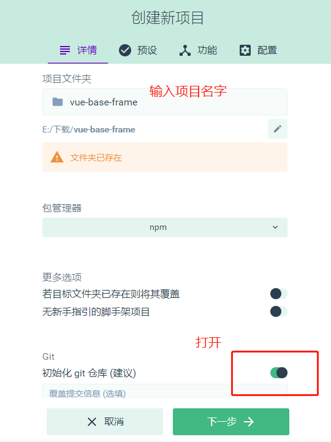
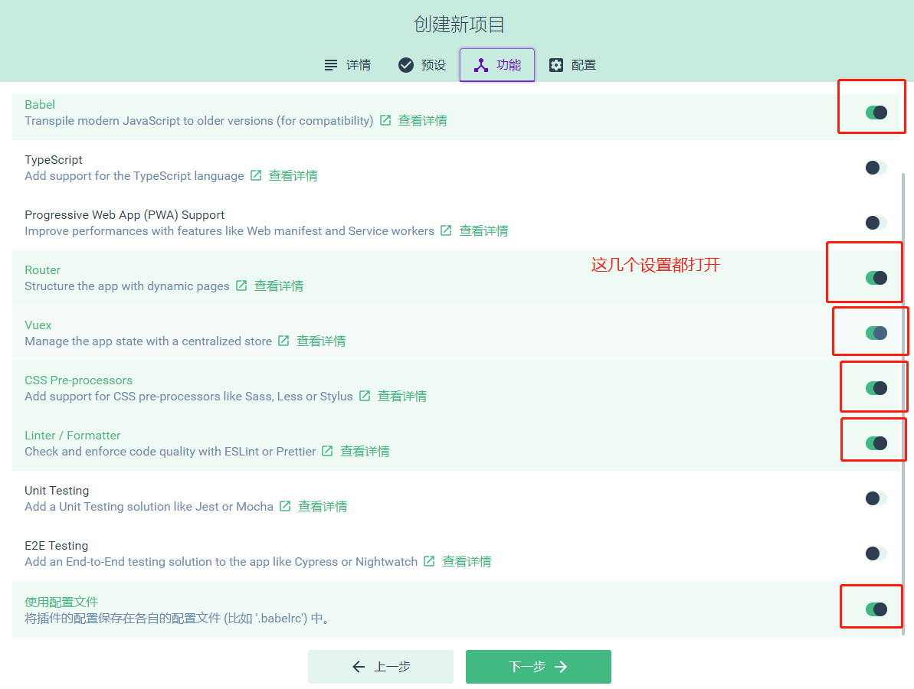
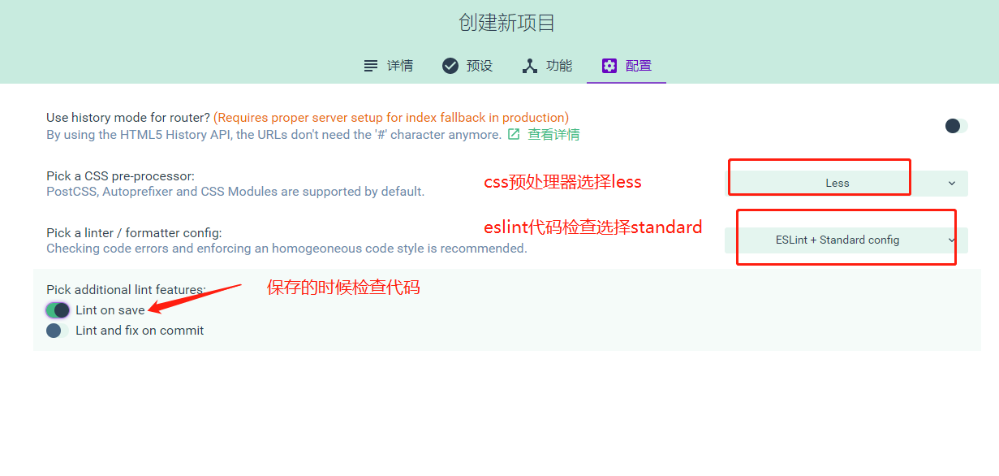
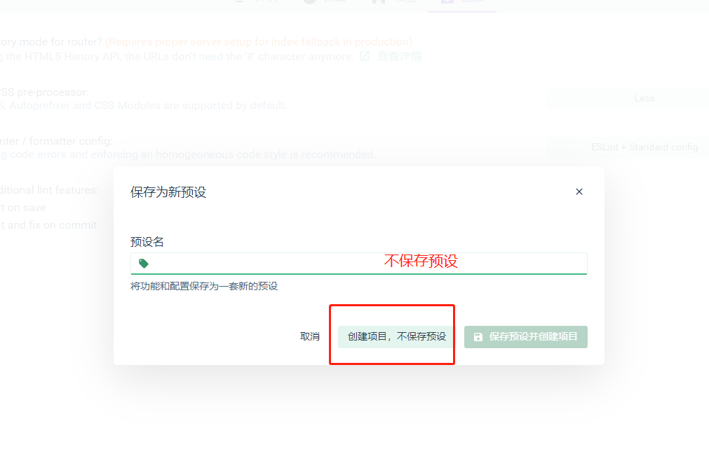
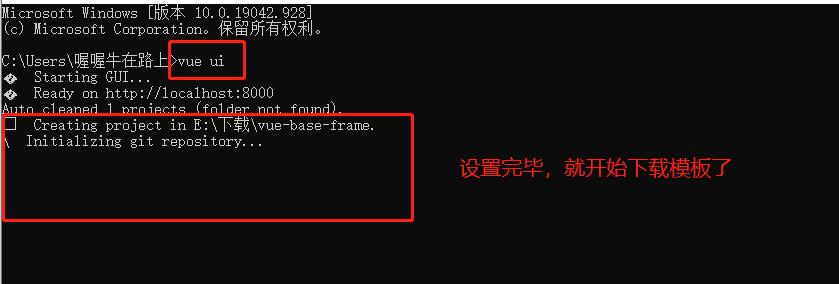

# 1. 使用vue-cli3.0创建项目

关键词：`vue ui`，`vue.config.js`

> 本文章涉及到的代码已上传至github[vue-base-frame](https://github.com/darenone/vue-base-frame)

vue-cli 3.x是基于webpack 4.0之上构建的vue脚手架工具，得益于webpack4.0的零配置特性，使得在使用vue-cli 3.0时，零配置就可以开发和打包vue项目

vue-cli 3.x及更高版本vue-cli 4.x为了区别vue-cli 1.x和vue-cli 2.x，名字更改成了@vue/cli，如果你的电脑已经安装了比如vue-cli 2.x，需要卸载它，然后安装@vue/cli，不用担心安装了更高版本的vue-cli不能兼容老项目，比如用vue-cli 2.x创建的项目，启动和打包还是分别使用npm run dev和npm run build即可
```
vue --version // 查看电脑上已安装的vue-cli的版本
npm uninstall vue-cli -g  // 卸载老版本vue-cli
npm install -g @vue/cli // 安装3.0版本的vue-cli
```
mac电脑卸载和安装vue-cli方式如下：
```
sudo chmod -R 777 /usr/local/lib/node_modules/  // 放开权限
sudo npm uninstall vue-cli -g  // 卸载老版本
sudo npm install -g @vue/cli  // 安装新版本
```
安装完毕，在cmd中输入vue ui，启动项目管理器，新建一个vue项目，在这个过程中需要操作步骤有：






经过上述步骤，就可以静待vue基础模板下载下来，当模板下载完成后，cmd进入项目根目录，执行npm run serve启动项目，这和vue-cli 2.x版本中npm run dev启动方式不一样，启动完成，浏览器打开这个项目，可以看到两个简单的页面Home和About，接下来，需要对这个vue模板进行改造，在改造之前，我先来介绍一下，项目里各个文件的作用

先从项目根目录开始看起，主要有三个文件
1. <b>package.json</b> 项目配置文件，项目中所需的依赖都会在这里说明，当其他人要使用你这个项目时，只需要执行npm install 就可以安装这些依赖，启动项目了，这里解析下json文件里面dependencies和devDependencies，dependencies声明生产环境所需要的依赖，也就是项目打包以后这些依赖也是要打包进去的，而devDependencies代表开发环境的依赖，也就是方便你开发而加载的一些依赖，这些依赖在项目打包时不会放进去
2. <b>public文件夹</b> 公共文件夹，在vue-cli 2.x创建的项目模板中，就是static这个文件夹，vue-cli 3.x创建的项目模板中，取而代之的就是这个public文件夹，这里面有一个index.html文件，它是提供给webpack，使其在运行和打包的时候作为模板文件使用，生成最后项目里的index.html
3. <b>src文件夹</b> 这是项目的主文件夹，以后我们开发都是在这个文件夹内完成的

再来看下src这个主文件夹里都有哪些文件：
1. assets 存放项目里的静态资源文件，比如图片，图标，字体文件等
2. components 从代码里抽离出一些可复用的逻辑组成一个组件，以便我们复用
3. views 项目里的页面都放在这个文件夹里
4. App.vue 项目里的基础组件（根组件）
5. main.js 项目的入口文件，项目在开发运行或者编译的时候，都会以这个为起始点
6. router 存放路由文件
7. store 存放状态管理文件

以上就是我们下载下来的初始vue模板的所有说明，这里提示一下，因为在启动vue ui（项目管理器）上开启了eslint代码检查，这里防止你以后写代码一直报空格和换行错误，需要在根目录里找到`.editorconfig`文件和`.eslintrc.js`文件，修改一下
```js
// .editorconfig.js
[*.{js,jsx,ts,tsx,vue}]
indent_style = space
indent_size = 4 // 将这个项目默认的2改为4
trim_trailing_whitespace = true
insert_final_newline = true
```
```js
// .eslintrc.js
  rules: {
    'indent': ['error', 4], // 新增这一行代码
    'no-console': process.env.NODE_ENV === 'production' ? 'warn' : 'off',
    'no-debugger': process.env.NODE_ENV === 'production' ? 'warn' : 'off'
  }
```
<b>vue.config.js文件</b>

你会发现通过vue-cli 3.x创建的项目里没有这个文件，是因为vue-cli3.x或者vue-cli 4.x是基于webpack4.0创建的，在使用vue-cli 3.x创建项目的时候，webpack的配置均被隐藏了，老版本的vue-cli 2.x或者vue-cli 1.x创建的项目，我们可以找到build和config这两个文件来存放项目的配置，但是vue-cli 3.x创建的项目已经没有这两个文件夹，当需要覆盖原有配置时，需要在根目录下新建`vue.config.js`文件，来配置新的配置，当项目启动以后`vue.config.js`会被自动加载，下面的代码就是我的项目中`vue.config.js`的基本配置
```js
// vue.config.js
/* --
如果当前是生产环境production
如果项目部署到域名（www.baidu.com）根目录下，直接'/' : '/',
如果需要部署到（www.baidu.com/iview-admin）目录下，直接'/iview-admin/' : '/'
如果是开发环境，直接'/' : '/' 
--*/
const BASE_URL = process.env.NODE_ENV === 'production' ? '/iview-admin/' : '/'
/* 引入node的path模块 */
const path = require('path')
/* 自定义方法resolve */
const resolve = dir => {
  return path.join(__dirname, dir);
}

// 引入webpack
// const webpack = require('webpack')


module.exports = {
  lintOnSave: false, // 关闭eslint检查
  /* webpack配置 */
  chainWebpack: config => {
    config.resolve.alias
      .set('@', resolve('src')) // 用@代替src，在项目里你需要引入文件的时候，只需要@/api,@/config,@/mock...即可
      .set('_c', resolve('src/components')) // 用_c代替src/components,我们需要引入组件时，只需要_c/HelloWorld.vue即可
  },

  // 打包时不生成map文件，这样减少打包的体积，并且加快打包的速度
  productionSourceMap: false,

  // 跨域配置
  devServer: {
    /* 自动打开浏览器 */
    open: true,
    hot: true, // vue cli3.0 关闭热更新
    // liveReload: false, // webpack liveReload关闭
    /* 设置为0.0.0.0则所有的地址均能访问 */
    host: '0.0.0.0',
    port: 4000,
    // proxy: 'http://localhost:4000', // 告诉开发服务器，将任何未知请求（没有匹配到静态文件的请求），都代理到这个url上，来满足跨域的请求
  },
  // configureWebpack: {
  //   plugins: [
  //     new webpack.ProvidePlugin({
  //       $:"jquery",
  //       jQuery:"jquery",
  //       "windows.jQuery":"jquery"
  //     })
  //   ]
  // },
}
```
<style>
    .page p, div, ol {
        font-size: 14px;
    }
</style>

